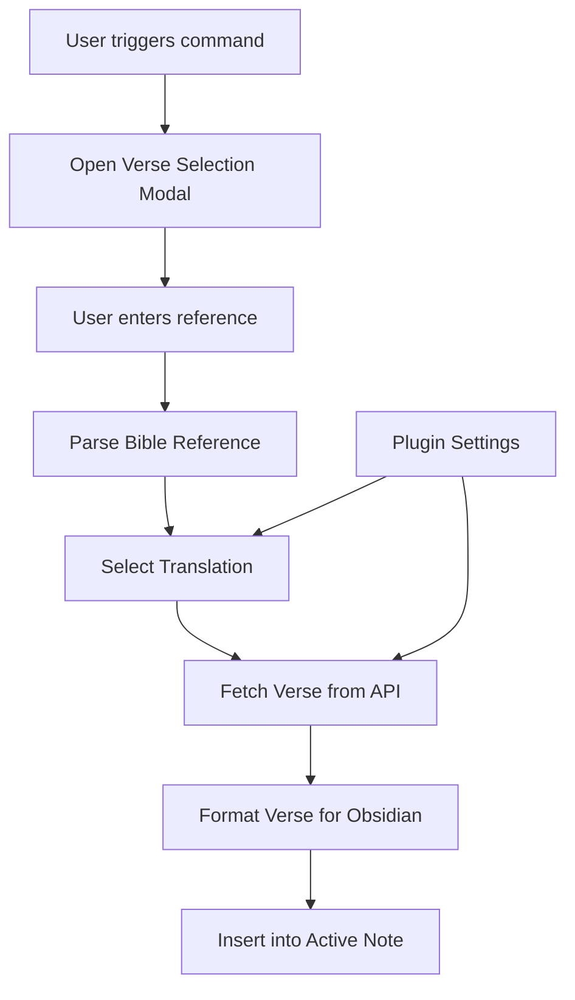

# The Scripture Injector - Architecture Plan

## Overview
"The Scripture Injector" is an Obsidian plugin designed to help pastors seamlessly integrate Bible verses into their notes. It provides a command palette interface to search, select, and insert formatted scripture passages.

## Core Components

### 1. Plugin Structure
```
the-scripture-injector/
├── src/
│   ├── main.ts                 # Main plugin entry point
│   ├── settings.ts             # Plugin settings and configuration
│   ├── modal.ts                # Verse selection modal
│   ├── api/
│   │   ├── bible-api.ts        # Bible API service interface
│   │   ├── esv-api.ts          # ESV Bible API implementation
│   │   └── net-api.ts          # NET Bible API implementation
│   ├── parser/
│   │   └── reference-parser.ts # Bible reference parsing logic
│   ├── formatter/
│   │   └── verse-formatter.ts  # Verse formatting for Obsidian
│   └── types/
│       └── bible.ts            # TypeScript type definitions
├── manifest.json               # Plugin manifest
├── package.json                # Dependencies and scripts
├── tsconfig.json               # TypeScript configuration
├── esbuild.config.mjs          # Build configuration
└── README.md                   # Documentation
```

### 2. Data Flow


### 3. Key Features

#### Bible Reference Parser
- Handles various reference formats: "John 3:16", "Romans 8:28-39", "Gen 1:1-2:3"
- Supports book name abbreviations and full names
- Validates chapter and verse ranges

#### API Integration
- **ESV API**: Requires API key, supports English Standard Version
- **NET Bible API**: No authentication required, supports New English Translation
- Configurable in plugin settings
- Error handling for API failures

#### Verse Formatting
- Uses Obsidian's quote callout with Bible icon
- Format: `[!quote]- John 3:16 (ESV) For God so loved the world...`
- Consistent styling for all translations

#### Settings Interface
- API key configuration for ESV
- Default translation selection
- Custom formatting options (future enhancement)

### 4. Technical Implementation

#### TypeScript Configuration
- Strict type checking
- Modern ES features with proper target for Obsidian
- Path aliases for clean imports

#### Build Process
- esbuild for fast compilation
- Watch mode for development
- Production optimization for distribution

#### Plugin Lifecycle
- `onload()`: Register commands and initialize services
- `onunload()`: Clean up resources
- `loadSettings()`: Load user configuration
- `saveSettings()`: Persist user preferences

### 5. Error Handling
- Network connectivity issues
- Invalid Bible references
- API rate limiting
- Missing API keys
- Graceful fallbacks and user-friendly error messages

### 6. Future Extensibility
- Support for additional Bible translations
- Custom formatting templates
- Verse comparison features
- Scripture commentary integration
- Offline verse cache

## Development Phases

### Phase 1: Foundation
1. Set up basic plugin structure
2. Create manifest and build configuration
3. Implement main plugin class
4. Create basic settings interface

### Phase 2: Core Functionality
1. Implement Bible API services
2. Create reference parser
3. Build verse selection modal
4. Add command palette integration

### Phase 3: Polish & Enhancement
1. Implement verse formatting
2. Add comprehensive error handling
3. Create documentation
4. Add unit tests

### Phase 4: Distribution
1. Optimize for production
2. Prepare for community release
3. Gather user feedback
4. Plan future enhancements